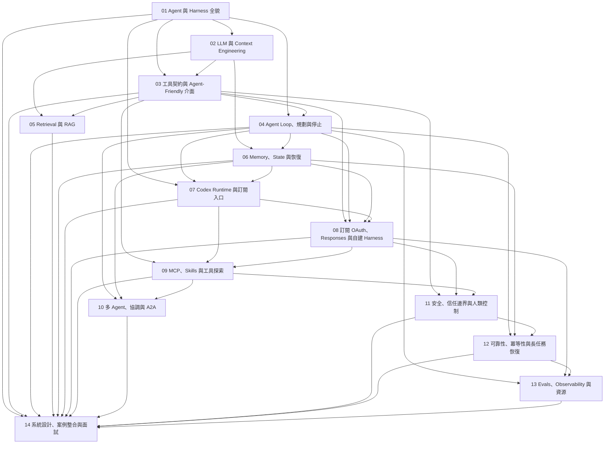

# 章節前置依賴

箭頭表示建議知識依賴，不是實作環境或檔案依賴。每章的最小前置摘要支援跳章；不要求跑完箭頭前的 lab。

```mermaid
flowchart TD
  C01["01 Agent 與 Harness 全貌"]
  C02["02 LLM 與 Context Engineering"]
  C03["03 工具契約與 Agent-Friendly 介面"]
  C04["04 Agent Loop、規劃與停止"]
  C05["05 Retrieval 與 RAG"]
  C06["06 Memory、State 與恢復"]
  C07["07 Codex Runtime 與訂閱入口"]
  C08["08 訂閱 OAuth、Responses 與自建 Harness"]
  C09["09 MCP、Skills 與工具探索"]
  C10["10 多 Agent、協調與 A2A"]
  C11["11 安全、信任邊界與人類控制"]
  C12["12 可靠性、冪等性與長任務恢復"]
  C13["13 Evals、Observability 與資源"]
  C14["14 系統設計、案例整合與面試"]
  C01 --> C02
  C01 --> C03
  C02 --> C03
  C01 --> C04
  C03 --> C04
  C02 --> C05
  C03 --> C05
  C02 --> C06
  C04 --> C06
  C01 --> C07
  C04 --> C07
  C06 --> C07
  C03 --> C08
  C04 --> C08
  C06 --> C08
  C07 --> C08
  C03 --> C09
  C07 --> C09
  C08 --> C09
  C04 --> C10
  C06 --> C10
  C09 --> C10
  C03 --> C11
  C08 --> C11
  C09 --> C11
  C04 --> C12
  C06 --> C12
  C11 --> C12
  C04 --> C13
  C08 --> C13
  C12 --> C13
  C01 --> C14
  C03 --> C14
  C04 --> C14
  C05 --> C14
  C06 --> C14
  C07 --> C14
  C08 --> C14
  C09 --> C14
  C10 --> C14
  C11 --> C14
  C12 --> C14
  C13 --> C14
```

[章節總覽](../README.md) · [跳章路線](../paths/interview-and-jump.md)
